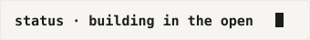

  <!-- 1. Header Banner Animasi -->
  

  <!-- 2. Intro Efek Mengetik -->
  

  

    
  

  <!-- 8. Badge Sosial Media (Email & GitHub Only) -->
  

    
    
  

---

### 🧑‍💻 About Me

  

- 📍 Berdomisili di **Yogyakarta, Indonesia**
- 🎓 *Student, maker, occasional automaton.*
- 🛠️ Membangun aplikasi web dengan **TypeScript & Next.js/React**, serta membuat otomasi desktop & Discord bot dengan **C#/.NET & Python**.
- 🚀 Sedang aktif eksplorasi proyek open-source dan otomasi sistem.

  

---

### 🛠️ Tech Stack

  <!-- 3. Badge Tech Stack -->
  

---

### 🏆 Achievements & Trophies

  <!-- 6. Trophy Pencapaian -->
  

---

### 📊 GitHub Activity & Stats

  <!-- 4. Stats & Top Languages berdampingan -->
  <table>
    <tr>
      <td>
        
      </td>
      <td>
        
      </td>
    </tr>
  </table>

  <!-- 5. Streak Stats -->
  

    
  

---

### 🐍 Contribution Snake

  <!-- 7. Snake Animation Graph -->
  <picture>
    <source media="(prefers-color-scheme: dark)" srcset="https://raw.githubusercontent.com/Rahmat-Rifai/Rahmat-Rifai/output/github-contribution-grid-snake-dark.svg" />
    <source media="(prefers-color-scheme: light)" srcset="https://raw.githubusercontent.com/Rahmat-Rifai/Rahmat-Rifai/output/github-contribution-grid-snake.svg" />
    
  </picture>

---

<!-- 10. Footer Banner Animasi -->

  

