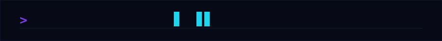
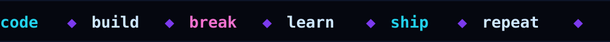
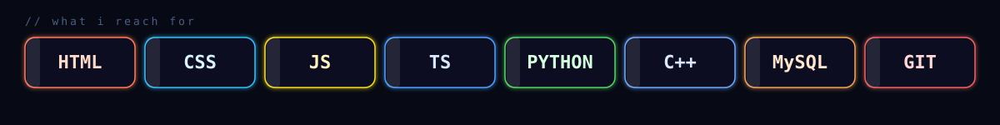
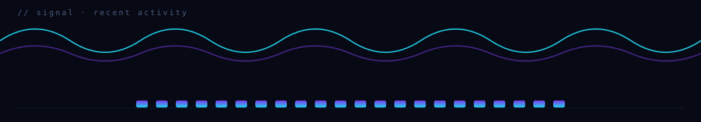

  

  

  

### stack

  

### signal

  

### projects

| repo | what's in it |
| --- | --- |
| [web](https://github.com/Rahmat-Rifai/web) | My portfolio. React 19 + TypeScript + Vite, with WebGL scenes in Three.js (`@react-three/fiber`), plus GSAP and Lenis for smooth scroll. |
| [Exam_Web](https://github.com/Rahmat-Rifai/Exam_Web) | UjianKu — an exam platform I built for school. Students and admins log in separately, the admin hands out exam tokens, and it auto-grades 45 multiple-choice questions across 3 subjects with a countdown timer. Monochrome UI. |
| [sav](https://github.com/Rahmat-Rifai/sav) | Arduino robotics from a class project: a Bluetooth RC car (HC-05, L298, HC-SR04) and a Leanbot (ESP32) driver with encoders, line sensors, and an ultrasonic. |
| [bot](https://github.com/Rahmat-Rifai/bot) | A Python bot that automates a Discord RPG — loops commands, scans dungeon solutions, catches captchas, and retries on rate limits. |
| [roadmap.sh-project](https://github.com/Rahmat-Rifai/roadmap.sh-project) | Frontend practice with roadmap.sh — a single-page CV and a few small builds. |
| [web_2](https://github.com/Rahmat-Rifai/web_2) | A sandbox for static web experiments in plain HTML and CSS. |

### now

  

  Yogyakarta, Indonesia · <a href="https://github.com/Rahmat-Rifai">github.com/Rahmat-Rifai</a>

